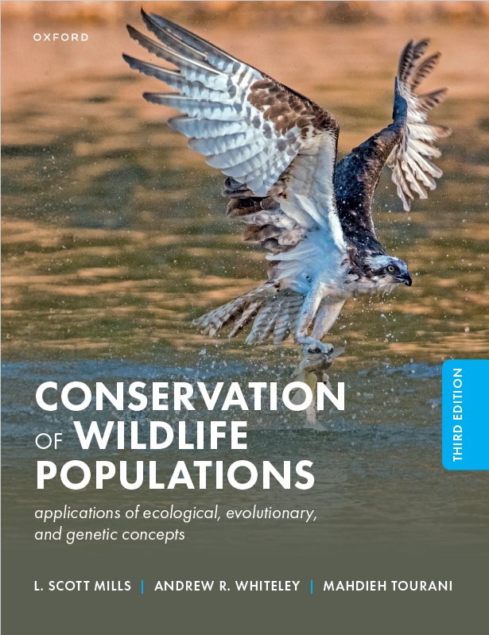

## Author Information

L. Scott Mills, Andrew Whiteley, and Mahdieh Tourani

Wildlife Biology Program, Department of Ecosystem and Conservation Sciences, University of Montana

--- {width="600"}

## Description 

In a world where threats of cataclysmic extinction loom and sustainable harvest approaches are essential, applied population ecology has never been more crucial. *Conservation of Wildlife Populations, 3rd Edition* provides evidence-based insight into how extinctions and human-wildlife conflicts can be minimized. L. Scott Mills, Andrew Whiteley, and Mahdieh Tourani blend rigorous science with practical solutions to illuminate paths where science and action can bring hope.\
\
Thoroughly updated since the second edition, *Conservation of Wildlife Populations* bridges the full scope of applied wildlife population ecology, spanning conservation and wildlife biology, ecology, conservation genetics, evolutionary biology, and environmental studies. This new edition includes updated references and expanded global case studies based on both terrestrial and aquatic wildlife species. With an engaging writing style and real-world examples, this third edition shows how a broad range of practical ecological and evolutionary principles can lead to efficient and sometimes non-intuitive conservation management in a rapidly changing world.\
\
Engaging and approachable, yet thorough and solutions-oriented, this is a must-read book for students and practitioners in ecology, wildlife biology, and conservation genetics. Undergraduate and postgraduate students will be equipped to advance conservation management and research, while field practitioners will find the scientific basis for making efficient and effective conservation decisions.
