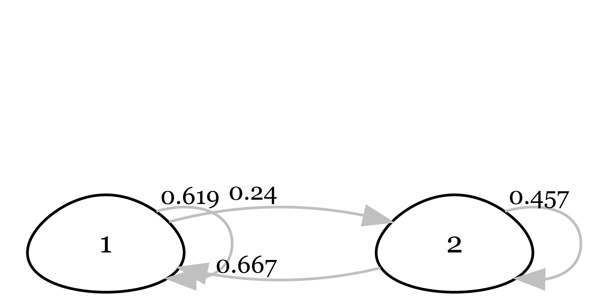
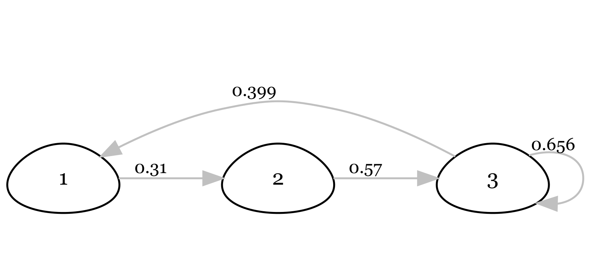

------------------------------------------------------------------------

## Chapter 1: The Big Picture

[1.]{.underline} A newly described vertebrate species is found in a remote jungle. Given that vertebrates make up roughly 3.5% of described eukaryotic species (Fig. 1.1), and there are \~2 million described species, calculate how many vertebrate species were already known prior to this discovery.

[2.]{.underline} Human numbers are projected to level off at 10.5 billion by 2100. If we dropped fertility to replacement levels today, why wouldn't the population stop growing immediately? Use the concept of population momentum to explain.

[3.]{.underline} The baseline extinction rate is estimated at 2 E/MSY (extinctions per million species per year). If there are 10,000 species of birds, how many would you expect to go extinct in a single century under "normal" deep-time conditions?

[4.]{.underline} Current extinction rates are estimated to be 10–30 times higher than the background rate. Using the 2 E/MSY baseline, calculate the current range of extinctions per million species per year.

🌶️ The Living Planet Index (LPI) is a measure of the state of the global biodiversity trends, including vertebrate species from terrestrial, freshwater and marine habitats. The 2016 LPI reported a 58% average decline in wild vertebrate populations since 1970. In this report, a total of 14,152 populations across 3,706 species were included. Based on this report, population sizes of vertebrate species have, on average, dropped by more than half in little more than 40 years. The dataset spanning years between 1970 and 2012 is public.

::: {style="background-color:beige;"}
**🔥Questions:**

(1) Write code to visualize data and provide data summaries to answer: are all studied wildlife populations in decline? Hint: Find out how many populations show at least 58% decline. What percentage of the studied populations are decreasing in each continent?

(2) Showcase a potential issue with the LPI. Hint: use data summaries and visualization in R to break down data, e.g., by taxa, realm, and continent. Bonus: Showcase a remedy to the issue.
:::

Where to start? You can use program R to load, summarize, visualize, and analyze data.

## Stepping stones in R

```         
(1) Open your existing RStudio Project for this course.
(2) Create a new R script and save it right away. 
(3) In the script, define key variables, and load any additional packages into the R environment. When you write code, always type in the “script” window in Rstudio. You can execute commands using command-enter or control-enter in Rstudio.
```

```{r, results = "hide", out.width = "600px", fig.align = "center", message = FALSE, warning = FALSE}
# 1.Load required packages-----------------------------------------------
library(utils)
# 2.Load the data into R------------------------------------------------
url_remote <-"https://raw.githubusercontent.com/"
path_git <-"MTourani/WILD470_S2025/refs/heads/main/"
file_name <-"LPI_LPR2016data_public.csv"
data <- utils::read.csv(paste0(url_remote, path_git, file_name))
# 3.Filter and clean the data--------------------------------------------
nrow(data)
ncol(data)
colnames(data)

```

------------------------------------------------------------------------

## Chapter 2: Gaining Reliable Knowledge

[1.]{.underline} A sample of 16 army cutworm moths was collected from a mountain top in Yellowstone National Park. The mean length of the sampled moths is 50 mm, and the sample variance is 4 mm.

a\. If the true mean length of the whole population is 20 mm and the true population variance is 15 mm, draw a target like one of those in Fig 2.1 that would depict the accuracy and precision of your sample of 16 moths relative to the true population metrics.

b\. What would happen to our estimated standard error (SE) if we increased the sample size? i.e., does the SE increase, decrease or stay the same?

c\. What would happen to the standard deviation (SD) if the sample size increased? i.e., does the SD increase, decrease or stay the same?

🌶️ Suppose a rare orchid population is found only in a specific forest tract slated for logging. To determine if this population should be protected under the Endangered Species Act (ESA), researchers conduct a study to see if it is genetically distinct from a common, widespread orchid species found throughout the state. Let's say the null hypothesis is: The rare orchid population is genetically identical to the common species (they are "homogeneous"). The Alternative Hypothesis is: The rare orchid population is a distinct subspecies. Because funding is limited and the flowering season is short, researchers only collect a small sample size of 10 orchids.

In this context, conservation scientists and policy makers often face a 'burden of proof' dilemma. Why the traditional null- hypothesis significant testing may be fundamentally mismatched with the 'precautionary principle' required for species conservation.

::: {style="background-color:beige;"}
**🔥Questions:**

1.  Explain the consequence of a Type II error (false negative) in a listing decision compared to a Type I error.
2.  Critique the common practice of interpreting a non-significant p-value as evidence of population homogeneity.
3.  Propose and describe one alternative statistical framework that could provide more transparency for judicial and administrative decision-making in conservation.
:::

------------------------------------------------------------------------

## Chapter 3: Genetic Concepts and Tools

[1.]{.underline} At a single locus in an endangered finch, there are three alleles with frequencies \$p\$, \$q\$, and \$r\$. Calculate the expected heterozygosity under Hardy-Weinberg equilibrium.

[2.]{.underline} A population of beetles has two alleles for color. The dominant allele is \$A\$ and the recessive allele is \$a\$. In a sample of 1,000 beetles, 160 display the recessive phenotype. Assuming the population is in Hardy–Weinberg equilibrium, what are the frequencies of the \$A\$ and \$a\$ alleles, and what proportion of the population is expected to be heterozygous? (Show your work)

[3.]{.underline} Explain why mtDNA is often more useful than nuclear DNA for species identification from small or degraded samples like a single hair found in the woods.

[4.]{.underline} Looking at the example of forensic application using microsatellite DNA in Figure 3.2, which deer, a, b, or c, did the antler tissue sample came from?

🌶️ Many populations of Pacific salmon (Oncorhynchus spp.) from southern California to northern Washington are listed for protection under the US Endangered Species Act 1973 (ESA). Here we use a [published](https://onlinelibrary.wiley.com/doi/10.1111/eva.13647) dataset on Chilkat River Chinook salmon (O. tshawytscha) in Southeast Alaska to estimate abundance using mark-recapture. This data set includes genetic data on sampled offspring and their assigned parent. First, let's explore the data. From 682 offspring, 220 were assigned to at least one parent. There are 147 unique parent IDs.

```{r, results = "hide", out.width = "600px", fig.align = "center", message = FALSE, warning = FALSE}

salmon <- read.csv("https://raw.githubusercontent.com/swrosenbaum/tGMR_simulations/main/Data/ParentPair.csv")

nrow(salmon)
length(unique(salmon$OffspringID))

# Remove duplicates
salmon <- salmon[!duplicated(salmon$OffspringID),]

# How many unique parent ID
unique(salmon$InferredMum)
unique(salmon$InferredDad)

# How many offspring were assigned parent
assigned_p <- salmon[which(salmon$InferredDad != "*"),]
assigned_m <- salmon[which(salmon$InferredMum != "#"),]

assigned <- salmon[which(salmon$InferredDad != "*" |
                           salmon$InferredMum != "#"), ]

```

Now, let's quantify key population abundance statistics. In its simplest form, the estimator (Lincoln–Petersen estimator with two sampling intervals; Chapter 4) will use the observed marks (n1): the number of successfully genotyped adult samples in the first sampling interval, the recaptures (m2): the number of genotyped adult samples that were assigned as parents of genotyped offspring from the second sampling interval, and the captures (n2): the number of genotypes obtained from juveniles sampled in the second interval.

Note that the number of sampled offspring is multiplied by 2, because offsprings carry genotypes of female and male parent and therefore have two opportunities to recapture marks.

```{r, results = "hide", out.width = "600px", fig.align = "center", message = FALSE, warning = FALSE}

capture   <- n2 <- 682 * 2                        # number of offsprings
mark      <- n1 <- 583                            # number of adults
recapture <- m2 <- 147                            # number of adults assigned to an offspring

N         <- round((n1 * (n2 + 1)) / (m2 + 1), 0) # adult abundance

```

Let's plot these quantities. We can use barplot() to make a side-by-side comparison.

```{r, results = "hide", out.width = "600px", fig.align = "center", message = FALSE, warning = FALSE}

bar_data <- matrix(c(N, capture, mark, recapture), nrow = 4)
colnames(bar_data) <- "Number of individuals"
rownames(bar_data) <- c("Abundance", "captured", "marked", "recaptured")
 
barplot( height   = bar_data,
         names    = "",
         legend   = rownames(bar_data),
         ylab     = colnames(bar_data),
         xlab     = NA,
         las      = 2,
         lwd      = 2,
         beside   = T,
         density  = c(10, 5, 20, 30, 7),
         angle    = c(45, 0, 90, 11, 36),
         col      = "brown")

```

We calculated adult abundance based on observed values at 5377. But remember from Chapter 2, we need to produce generalisable results. If we repeat the sampling, each time we get a different estimate of the population size. For the Lincoln-Peterson estimator, the variation in estimates can be calculated as below.

```{r, results = "hide", out.width = "600px", fig.align = "center", message = FALSE, warning = FALSE}

var       <- (n1 ^ 2 * (n2 + 1) * (n2 - m2)) / ((m2 + 1) ^ 2 * (m2 + 2)) # variance; equation 4.9

```

Sampling variance is a common statistic to show parameter uncertainty. How about the 95% confidence intervals of the population size estimate? Well, we can calculate that using the standard deviation of the sampling variance, i.e, the standard error.

```{r, results = "hide", out.width = "600px", fig.align = "center", message = FALSE, warning = FALSE}

uci <- N + (1.96 * (sqrt(var)))  # equation 4.10, in chapter 4
lci <- N - (1.96 * (sqrt(var)))

round(c(lci, uci), 0)

```

Based on this analysis, the Chinook salmon abundance is between 4562 and 6192, with a mean estimate of 5377 individuals.

::: {style="background-color:beige;"}
**🔥Question:**

Generate new data using the probability distribution for m2, number of recaptures. How does the estimate of N change with different numbers of recaptures?
:::

------------------------------------------------------------------------

## Chapter 4: Estimating Population Size and Vital Rates

[1.]{.underline} Suppose you are studying a jaguar population using camera traps, and you are interested in estimating the population size using the Lincoln-Petersen model. During the first period of camera trapping, you uniquely identify 14 jaguars. During the next sampling period, you identify 16 jaguars, 6 of which you had previously detected.

a\. What is the detection probability of jaguar at camera traps?

b\. Estimate jaguar abundance and variance in this population?

c\. Use your results from the previous question to calculate the 95% confidence intervals for your estimate of abundance.

d\. Why is it important to include detection probability in our abundance estimate, instead of just using the count of jaguars?

[2.]{.underline} What happens to your estimates of detection probability and abundance if wolverines chew off their tags and lose them during a capture-recapture study?

[3.]{.underline} In a capture-recapture model of a quail population abundance with 3 samples, what is the probability of detection history 110 in each of the following scenarios:

i\. the probability of detection is assumed to be constant.

ii\. the probability of detection is assumed to vary between sample occasions.

iii\. the probability of the initial detection is assumed to be different from the probability of subsequent detections.

[4.]{.underline} Suppose you are studying snowshoe hare survival, using the Kaplan-Meier method. At the beginning of the study (year 1), 33 hares were GPS-collared. When checked at year 2, you found 2 hares dead and lost the signal of 1 collared hare. You collared 5 new hares in year 2.

a\. What is the probability of surviving the first year?

b\. What is the probability of surviving the second year?

c\. By using this method to estimate survival, what assumptions are you making?

🌶️ The the Lincoln-Peterson method is used to estimate the abundance of a closed population using mark-recapture data. Using this method, animals do not need to be uniquely marked to estimate abundance. We learned that: $\hat{N}$ = $\frac{n_1 n_2}{m_2}$, where $n_1$ is the number of animals caught and marked in the first sample, $n_2$ is the number of animals caught in the second sample, and $m_2$ is the number of animals caught in both samples.

We could use R to estimate abundance using the Lincoln-Peterson estimator.

First, let's create three objects n1, n2, and m2 and store the sampling data. We captured 44 individuals on the first sample occasion, 32 individuals on the second sample occasion, and 15 individuals were captured in both sample occasions.

```{r, results = "hide", out.width = "600px", fig.align = "center", message = FALSE, warning = FALSE}
# 1. Define objects --------------------------------------------------------
n1 <- 44
n2 <- 32
m2 <- 15

```

Remember that R will ignore any code that follows a #. Before moving on, use comments to define what each object represents (e.g., Number of individuals captured on first occasion, Number of individuals captured on second occasion, Number of previously marked individuals captured on second occasion).

Then, highlight all three lines and then click Ctrl + Enter (or command + return on Mac) to run the code. Can you type in the LP equation in R? What is the estimated abundance of this population?

```{r, results = "hide", out.width = "600px", fig.align = "center", message = FALSE, warning = FALSE}
# 2. LP Estimator ------------------------------------------------------
N <- n1 * n2 / m2
N
```

This formula is a statistic estimating total population abundance on the basis of a sample. Recall from the lecture on inference, we still need to make inference about the parameter, N, on the basis of the statistic, $\hat{N}$. To do this, we need to understand the sampling uncertainty for this statistic (we need to ask: “what do we really know about the population, and what don’t we know?”). That is, if we collected a different sample from the same population, we might get a very different answer for N. If we took 100 or 1000 different samples, we might get 100 or 1000 different estimates for N. The variation among these estimates is the sampling uncertainty.

We can calculate the uncertainty (i.e., variance) of our estimated abundance using:

var($\hat{N}$) = $\frac{(n_1 + 1)(n_2 + 1)(n_1 - m_2)(n_2 - m_2)}{(m_2+1)^2(m_2+2)}$

This formula technically represents sampling variance, which is a common way to represent parameter uncertainty in statistics. Can you create a new object called "tau" and calculate variance of our estimated abundance in R?

```{r, results = "hide", out.width = "600px", fig.align = "center", message = FALSE, warning = FALSE}
# 3. Calculate variance -----------------------------------------------------
tau <- ((n1+1)*(n2+1)*(n1-m2)*(n2-m2))/((m2+1)^2*(m2+2))  
tau
```

How reliable is our abundance estimate? To find out, we can construct confidence intervals around the estimate and quantify the precision. A confidence interval is a range of values which is expected to include the true abundance a given percentage of the time. Typically, the given percentage is 95%, but confidence interval could also be 90% or 99%, or any range you wish. The upper and lower values of a confidence interval are called the confidence limits. Clearly, we want confidence intervals to be as small as possible.

How can we find the confidence interval? First, we find the standard deviation of the sampling variance (usually called “standard error” of the statistic) which is just the square root of the sampling variance:

$$se({\hat{N})=\sqrt{var{\hat{(N)}}}}$$

```{r, results = "hide", out.width = "600px", fig.align = "center", message = FALSE, warning = FALSE}
# 4. Calculate standard error  -------------------------------------------------
se <- sqrt(tau)
se
```

We can use the sqrt() function to take the square root if the sampling variance, or any other quantity.

Then, the 95% confidence interval for $\hat{N}$ is approximately 2 “standard error” units from the value of $\hat{N}$:

$\hat{N}$ $\pm$ 1.96$\times$ $se(\hat{N})$

```{r, results = "hide", out.width = "600px", fig.align = "center", message = FALSE, warning = FALSE}
# 5. Confidence interval  ------------------------------------------------------
lci <- N - 1.96 * se
uci <- N + 1.96 * se

lci
uci
```

::: {style="background-color:beige;"}
**🔥Question:**

1.  Type in the Lincoln-Peterson estimator and report the estimated abundance of the first example population?
2.  Calculate the variance of the estimated abundance in R and report the variance.
:::

------------------------------------------------------------------------

## Chapter 5: Exponential (or Geometric) Change

[1.]{.underline} Use the discrete population growth model to find the abundance of a population last year if the abundance is 2,000 this year and the geometric growth rate is 0.5.

a\. By what percentage is the population increasing or decreasing each year?

b\. Starting from the population size this year, what will the size of the population be if it continues to grow at the same rate for a total of 4 years?

c\. What is the population’s instantaneous growth rate if it takes 2 years to double in size?

d\. Based on the instantaneous growth rate, is this population stable, growing, or shrinking?

[2.]{.underline} Why is the geometric mean a better descriptor of a fluctuating population's long-term growth than the arithmetic mean?

[3.]{.underline} A population of 10 individuals has an expected survival rate of 70%. Explain why the realized survival rate in any given year is unlikely to be exactly 70% due to demographic stochasticity.

🌶️ One non-intuitive idea that emerged from Chapter 5 in the text is that (under many conditions) the average growth rate of a population might be much higher than the most likely population trajectory. That is, when conditions are variable, population dynamics are governed not by the arithmetic mean, but rather by the geometric mean. Let’s see how that plays out.

Suppose a sage grouse population abundance was at 50 individuals in year 2020 and 65 individuals in year 2021. We can calculate the geometric growth rate $\lambda$ and the exponential growth rate $\rho$ as:

```{r, results = "hide", out.width = "400px"}

N1 <- 50
N2 <- 65

lambda <- N2/N1  # geometric growth rate
rho <- log(lambda) # exponential growth rate

print(lambda)
print(rho)

```

If managers have monitored the sage grouse population over 10 years, we can use the time-series to calculate the annual growth rate $\lambda_y$.

```{r, out.width = "400px"}

year <- 2012:2021
abundance <- c(52, 43, 90, 125, 72, 128, 97, 50, 50, 65)

sg_data <- data.frame(matrix(nrow = length(year),
                             ncol = 3))
colnames(sg_data) <- c("year", "abundance", "lambda_y")

sg_data$year <- year
sg_data$abundance <- abundance

for(i in 1:length(sg_data$year)) {
  sg_data$lambda_y[i] <- sg_data$abundance[i + 1] / sg_data$abundance[i]
}

print(sg_data)

```

Now, to calculate the average annual growth rate we need to understand the difference between the arithmetic mean $\lambda_a$ vs the geometric mean $\lambda_g$. We calculated $\rho$ above based on $\lambda_g$, but what it means is a constant fraction or proportion of the current population is added to or subtracted from the population continuously or instantaneously. The geometric growth means a constant fraction or proportion of the current population is added to or subtracted from the population at each discrete time step. Finally, the arithmetic Growth means a constant number of individuals is added to or subtracted from the population at each time step, regardless of the current population size.

```{r, results = "hide", out.width = "400px"}

#Arithmetic mean
lambda_a <- mean(sg_data$lambda_y, na.rm = TRUE)

#Geometric Mean
lambda_g <- prod(sg_data$lambda_y, na.rm = TRUE) ^ (1 / length(sg_data$lambda_y))

```

With a known growth rate, projection of abundance is done based on: $N_{t+1}$ = $N_{t}$ $\lambda$ or equally based on: $N_{t}$ = $N_{1}$ $\lambda^t$. If we project abundance of the grouse population based on these two calculated growth averages, we get different numbers. You noticed that $\lambda_y$ for the year 2021 was NA, and the abundance for this year was 65. Which of the two growth rate averages leads to this abundance for the year 2021? As you see below, $\lambda_g$ describes the most likely future trajectory of a population with stochastic growth. Overall, $\lambda_g$ is smaller than $\lambda_a$ whenever $\lambda_y$ varies across the years.

```{r, results = "hide", out.width = "400px"}

print(lambda_a)
print(lambda_g)

#Projected N
sg_data$abundance[1] * (lambda_a ^ length(year))
sg_data$abundance[1] * (lambda_g ^ length(year))

```

We saw in the text the two intuitive ways most commonly used to estimate average exponential trend: a) drawing a line through the log(abundance) data over time; b) taking simple averages of the consecutive series of r values. However, we also saw that these methods can give different, and possibly inappropriate, answers because they make fundamentally different assumptions about the processes that cause variation in population growth over time. The first approach assumes that all the variation in the abundances over time comes from observation error (OE). The second assumes that all the variation in the average growth rate arises from process noise (PN). Here we’ll get some hands-on practice with the EGOE and EGPN trend estimators and will analyze both sources of variation at once using a state-space model (EGSS).

::: {style="background-color:beige;"}
🔥**Questions:**

1.  With an initial abundance of 50 in year 2020, project abundance for years 2025 and 2027, assuming situations (a) and (b) and then visualize the two projections of population abundnace.

<!-- -->

(a) growth is deterministic ($\lambda_y$ = 1.05) over the years.
(b) growth is stochastic and fluctuates between 1.55 and 0.55 ($\lambda_{2020}$ = 1.05, $\lambda_{2021}$ = 0.55, $\lambda_{2022}$ = 1.05, $\lambda_{2023}$ = 0.55, etc).
:::

<br>

------------------------------------------------------------------------

## Chapter 6: Structured Population-Projection Models

[1.]{.underline} Given the frog matrix in Fig. 6.1, calculate the annual survival of a juvenile frog. Hint: Sum the transition terms that do not involve reproduction.

[2.]{.underline} Each adult frog has a reproductive value 300 times higher than a pre-juvenile (Fig. 6.7). If you have limited funds for a translocation, which stage should you prioritize to jump-start population growth?

[3.]{.underline} Using the loggerhead sea turtle example, explain why increasing hatchling survival alone was insufficient to stop the population decline.

[4.]{.underline} Suppose you are tasked with studying a caribou population, and you want to know what the analytical sensitivity is for adult survival. Prior to calculating sensitivity, you estimated the asymptotic population growth rate as 1.053. You add 0.01 to adult survival and calculate the new growth rate as 1.064. What is the analytical sensitivity of adult survival?

{width="500"}

{width="500"}

🌶️Above, you are presented two life cycle diagrams of two bird species. Please answer 10 questions below for each of the two diagrams.

::: {style="background-color:beige;"}
**Questions:**

(1) Based on the diagram, is the life cycle age-structured or stage-structured? Describe your reason.

(2) For this population, what is age/stage at first reproduction?

(3) What percentage of individuals stay in Class 1 each year?

(4) What does each arrow represent?

(5) What does each number on each arrow represent?

(6) What percentage of individuals in the last class survive each year?

(7) Could you compare survival of individuals in this population?

(8) Write out the projection matrix for this population (using parameter names and numbers).

(9) Write out the equation to project the population forward 1 year.

(10) Can you summarise the profile of this bird? Can you make a guess on the species name?
:::

## Chapter 7: Density-Dependent Population Change

[1.]{.underline} Draw a graph showing how population size varies over time for a population following logistic growth. Label your axes appropriately and use this graph to answer the following questions. a. Where is the population growing the fastest? Circle that region and label it with “A”. b. Where is population growth limited by the number of individuals? Circle that region and label it with “B”. c. Where is the population limited by small per-capita growth rate? Circle that region and label it “C”. d. For the region of the graph you labelled “C,” what might be causing the low per-capita growth rate?

[2.]{.underline} What is a strong Allee effect? Explain why a population might decline toward extinction even if \$N \> 2\$.

[3.]{.underline} Draw two graphs showing how per capita mortality rate could vary with population size. If birth rate is constant in both graphs, indicate the carrying capacity, positive population growth and negative or positive density dependence on each graph.

🌶️ Although we have emphasized that logistic growth is just one special form of negative density dependence, it turns out that wolves reintroduced into the northern rockies exhibit negative density dependence that can be reasonably modeled using logistic growth. Ever since wolves were introduced into Yellowstone and Central Idaho, the USFWS has kept a pretty good tab on total wolf numbers in the US Northern Rockies. For this exercise we will use these data from 1995-2015 (representing the total wolf count in Yellowstone, Central Idaho and NW Montana).

In this exercise, we directly create an R object as data, and use the stats package in R. We define our model parameters, and set up a storage dataframe to store the population size data.

We can store data in memory by assigning it to an “object” using the assignment operator \<-. For example, the code below would assign the object wolf_data the population size values of 101 - 1881.

```{r, out.width = "400px", fig.align = "center"}

wolf_data <- data.frame(year = 1995:2015,
                        N    = c(101, 152, 213, 275, 322, 437, 563, 663,
                                 761, 846, 1020, 1300, 1513, 1655, 1733,
                                 1723, 1804, 1715, 1691, 1787, 1881))

```

You can inspect the dataframe wolf_data and find out how many years of data is provided.

After 25 years the wolf population may have reached a relatively constant population size consistent with a carrying capacity ($K$). Note that this number is probably determined more by human tolerance than by ‘natural’ density dependence factors like food availability, territoriality disease, etc. Still, ‘human tolerance’ carrying capacities are not uncommon, especially for large carnivores.

You can use the plot() function to visualize how this wolf population changes with time. What are the x and y variables in this plot? Could you change the color, size, and shape of the points?

```{r, out.width = "400px", fig.align = "center"}

plot(wolf_data$year,
     wolf_data$N,
     ylab     = "Abundance",
     xlab     = "Year",
     cex.lab  = 1.5,
     pch      = 19,
     col      = "darkgray",
     cex      = 2,
     xaxt     = "n",
     las      = 2)
axis(1)

```

Eyeballing from plotting abundance over the years, what is the approximate carrying capacity for wolves in the US Northern Rockies?

Let's calculate per capita exponential growth rate $\rho_t$. Notice that even though the growth seems pretty steady in the previous graph, it actually fluctuates quite a bit year to year.

We can use a for-loop, similar to the previous lab to calculate $\rho_t$ for each time step.

```{r, out.width = "400px", fig.align = "center"}

rho_t <- NA
for(t in 1 : length(wolf_data$N)) {
  rho_t[t] <- log(wolf_data$N[t + 1] / wolf_data$N[t])
}


```

You can visulaize how the per capita growth rate changes over time as shown below.

```{r, out.width = "400px", fig.align = "center"}

plot(wolf_data$year,
     rho_t,
     ylab    = "Exponential Growth Rate",
     xlab    = "Year",
     cex.lab = 1.5,
     pch     = 19,
     cex     = 2,
     xaxt    = "n",
     type    = "l",
     lwd     = 3,
     las     = 2)
axis(1)

```

In order to determine the intercept of the linear relationship between N and $\rho$ we can use a linear regression. This is $\rho_0$ for the logistic growth model.

```{r, out.width = "400px", fig.align = "center"}

mod <- lm(rho_t ~ wolf_data$N)   # linear regression model 
summary(mod)

plot(wolf_data$N,
     rho_t,
     ylab    = "Exponential Growth Rate",
     xlab    = "Abundance",
     cex.lab = 1.5,
     pch     = 19,
     cex     = 2,
     xaxt    = "n",
     las     = 2)
axis(1)
abline(mod, col = "red", lwd = 2)


```

Now, plot the fitted line from the linear model over the plot of $\rho$ against N using R function abline().

Looking at the model output, the first coefficient is the intercept and the second coefficient is the slope of the red line.

```{r, out.width = "400px", fig.align = "center"}

rho_0 <- mod$coefficients[1]
slope <- mod$coefficients[2]
	
```

With these two numbers we can calculate the carrying capacity K.

```{r, out.width = "400px", fig.align = "center"}

K <- rho_0 / abs(slope)

```

Let’s see how well these two parameters ($\rho_0$ and K) characterize our wolf population under a logistic growth model. First, we project the wolf population 50 years using an initial abundance of 101 and the discrete form of the logistic growth equation.

You can use the code below to assign $nyear$ to value 50, initial population size to value 101, and find the population size over 50 years. You can use a for-loop to avoid repeating similar line of code per year and store the values in object $N_t$ .

```{r, out.width = "400px", fig.align = "center"}
n_year <- 50
N_t <- rep(NA, n_year)
N_t[1] <- 101
	
for (t in 2 : n_year - 1) {
  
  # discrete logistic growth equation
  N_t[t + 1] <- N_t[t] * exp(rho_0 * (1 - (N_t[t] / K)))
}

```

We can now visualize the estimated abundance as a line graph and add the data points for comparison. As you see with this visualization, the logistic growth model fits the data very well. The wolf population appears to be experiencing density dependent growth with an exponential increase in growth initially that slowed to a carrying capacity around 1874.

```{r, out.width = "400px", fig.align = "center"}

plot( x        = 1 : n_year,
      y        = N_t,
      xlab     = "Year",
      ylab     = "Abundance",
      sub      = "Estimated wolf population abundance over 50 years",
      cex.lab  = 1.5,
      cex      = 2,
      xaxt     = "n",
      type     = "l",
      lwd      = 3,
      las      = 2
)
axis(1)

points( x   = 1 : length(wolf_data$N),
        y   = wolf_data$N,
        pch = 21,
        cex = 2,
        col = "darkgray"
)

```

Environmental stochasticity could cause K to vary over time. Another mechanism that can cause a population to fluctuate around K has nothing to do with stochasticity. Even deterministically growing populations can overshoot K when there is a lag in the effect of the proximity of N to K on r. The magnitude of r and the time lag involved can both influence these dynamics.

::: {style="background-color:beige;"}
**🔥Questions:**

1.  With different values of $\rho_0$ (between about 1 and 3) in the discrete logistic growth equation estimate abundance to achieve examples of:

    a\. damped oscillations

    b\. two-point stable limit cycles

    c\. four-point stable limit cycles

    d\. chaos

<!-- -->

2.  Create a line graph that represents each, with the value of $\rho_0$ that you used labeled on each plot.
3.  Which of these sources of “noise” around K— stochastic K or damped oscillations/stable limit cycles/chaos— do you think is more common in real wildlife populations? Why?
:::

## Chapter 8: Predation and Wildlife Populations

[1.]{.underline} Calculate the survival probability of a population of mule deer with a 20% predation mortality rate and a 30% mortality rate from other causes when: a. predation mortality is fully additive b. predation mortality is fully compensatory

[2.]{.underline} Suppose you’re a manager tasked with protection of a population of rare birds called deer grouse. There’s a native hawk species that hunts the deer grouse. Biologists recently discovered an invasive rodent species called the dusky mouse that eats the eggs of the deer grouse. The dusky mouse population is growing quickly. What do you need to consider before taking action to protect the deer grouse from the invasive dusky mouse?

[3.]{.underline} If you’re an elk in Yellowstone National Park, what would your survival strategy be if you know that wolves hunt you in valley bottoms during the day and pumas hunt you in rocky terrain at night? Name a potential fitness cost of your strategy. What term describes the effect of the predators on your behavior?

[4.]{.underline} Which panel in figure 8.2 matches the following predator-prey interaction where lynx populations in a boreal forest increase in abundance as snowshoe hare populations increase. The rate of that increase slows as the hare population gets bigger. Because the snowshoe hares are masters of camouflage, Lynx need to spend more time searching for hares to pursue when hare populations are low.

[5.]{.underline} Draw a graph of predation rate (% prey killed) against prey abundance. Indicate the area of positive or negative density dependence on this graph.

🌶️Management of critically endangered species may pose considerable scientific and ethical dilemmas. Channel Islands are inhabited by an endemic, carnivore species, the island fox (Urocyon litteralis). These islands are also populated by introduced feral pigs (Sus scrofa). The presence of pigs (and the loss of bald eagles) enabled golden eagles (Aquila chrysaetos) to colonize the islands in early 1990’s. The eagles prey mainly on pigs and foxes are their secondary, alternative prey. Canine distemper became an issue in the late 1990s. The species was listed as endangered, and things looked bleak for island fox. Science-based conservation recommendations were badly needed, and time was short.

The rate of predation by a predator population is determined by two attributes of the predator's response to changes in prey density: functional response and numerical response. The numerical response is simply how predator number changes as prey abundance changes. The functional response relates a single predator's prey consumption rate to prey population density.

Suppose we have a long-term dataset of abundance of Island fox, the prey, on an island and the number of prey killed per eagle predator (indexed by fox teeth per eagle scat). Predation rate is the percentage of the prey population killed per unit time.

```{r, results = "hide", out.width = "400px", fig.align = "center"}

fox_data       <- data.frame( years        = 1:22, 
                              abundance    = round(runif(22, 20, 200), 0))
fox_data$eaten <- 0.25 * fox_data$abundance
pred_rate      <- fox_data$eaten / fox_data$abundance * 100
print(pred_rate)

```

However, the predation rate in nature is rarely constant over time. The number of prey killed will be a product of both the number of predators (the predator numerical response) and how many prey each individual predator kills (the predator functional response), i.e., number of prey killed is the predator numerical response times the predator functional response. If the prey-dependent functional response that we used was: y = 2.62 N / \[6.53 + N\], then the functional response increases with numerical response.

```{r, out.width = "400px", fig.align = "center"}

eagle_data <- data.frame( years        = 1:22, 
                                abundance    = round(runif(22, 8, 20), 0))
fox_data$eaten_per <- mean(fox_data$eaten) / eagle_data$abundance
kill_rate <- (2.62 * fox_data$abundance) / (6.53 + fox_data$abundance)


plot(y        = eagle_data$abundance,
     x        = fox_data$abundance,
     ylab     = "Numerical response of eagle",
     xlab     = "Prey abundance",
     cex.lab  = 1.5,
     pch      = 19,
     col      = "darkgray",
     cex      = 2,
     xaxt     = "n",
     las      = 2)
axis(1)

```

Predator population size could linearly, quadraticly or hyperbolicaly change with prey population size, or not dependent on it at all. Let's plot the functional response, i.e., the number of foxes eaten against fox abundance. There are three types of functional response; which type do you suspect of the plot below?

```{r, out.width = "400px", fig.align = "center"}

plot(y        = kill_rate,
     x        = fox_data$abundance,
     ylab     = "Functional response of eagle",
     xlab     = "Prey abundance",
     cex.lab  = 1.5,
     pch      = 19,
     col      = "darkgray",
     cex      = 2,
     xaxt     = "n",
     las      = 2)
axis(1)

```

Type 2 functional response is common in nature. At low prey densities, predators take prey in an almost constant-effort fashion: if prey density doubles, then predator locates them twice as often and kills them at twice the rate. Thus, rate of predation increases almost linearly at low prey density. As prey density increases, searching for prey becomes a less important limit on the rate of predation. Prey are easy to locate, and rate of consumption is more heavily affected by handling time, the time it takes to catch, subdue, kill and eat a prey item, once prey located.

As searching becomes less important and handling becomes more important, the rate of predation shows decelerating rate of increase. (still increases, but less quickly) Eventually, search is not limiting at all, and rate of predation levels off at upper limit determined by handling time alone.

Let's calculate predation rate and the number of prey eaten from the kill rate we calculated above.

```{r, results = "hide", out.width = "400px", fig.align = "center"}

pred_rate      <- kill_rate / fox_data$abundance  * 100
n_eaten        <- kill_rate * eagle_data$abundance
print(kill_rate)
print(pred_rate)
print(n_eaten)

```

::: {style="background-color:beige;"}
**🔥Questions:**

1.  By comparing the predation rate and population size, are the changes stabilizing or destabilizing for the fox population?
2.  Use a function to describe the numerical response curve which changes positively with prey abundance. How does this change affect the predation rate? Find out if the predation rates are stabilizing or destabilizing the fox population.
3.  Use two different functions to describe types 1 and 3 functional response curves. Then, visualize the curves for comparison.
:::

------------------------------------------------------------------------

## Chapter 9: Genetic Variation and Fitness

[1.]{.underline} After how many generations of genetic drift in an isolated population does the inbreeding coefficient for a subpopulation relative to the total population reach 0.01 if the effective population size is 50?

[2.]{.underline} What is the inbreeding coefficient for a subpopulation relative to the total population of an isolated species experiencing genetic drift after 2 generations if the effective population size is 50?

[3.]{.underline} Suppose you are studying a subpopulation of bighorn sheep within a larger metapopulation. You estimate FST of 0.7. a. What does that tell you about genetic variation in the subpopulation? b. You also found that juvenile survival has decreased by 40% in the subpopulation, although you did not find a significant change in the mean population growth rate. What does this suggest about inbreeding depression in the subpopulation?

[4.]{.underline} Why did the founder effect not have a significant negative impact on the genetic variation of the Yellowstone wolf population after the first ten years if only 31 individuals were translocated to the park?

🌶️Suppose individuals in a wildlife population are found to suffer a fatal genetic disorder that has a genetic basis, recessive inheritance, and shows up in 1 out of every 400 individuals.

We’ll assume only 2 alleles and refer to the dominant (normal) allele as F, and to the fatal disorder disease allele as f. 0.25 percent of the population suffer from the disease. What are the allele frequencies? What percent of the population is a non-affected “carrier” of the allele or a homozygous FF?

```{r, results = "hide", out.width = "400px", fig.align = "center"}
percent <-   1 / 400 * 100 

# allele frequencies
freq_f <- sqrt(1/400) 
freq_F <- 1- freq_f 
freq_Ff <- 2 * freq_f * freq_F # HW 
freq_FF <- 2 * freq_F * freq_F  

print(freq_F)
print(freq_f)
print(freq_Ff)
print(freq_FF)

```

Under HW conditions, allele frequencies in the next generation are theoretically predicted as p = q = 0.5. In reality, allele frequencies might deviate from theory just by chance. Genetic drift occurs when allele frequencies change randomly, or drift, from one generation to the next just because some alleles get passed on from parents to offspring while others do not.

Every individual in the population has a 50% chance to inherit the F-allele on its first chromosome, and a 50% chance to inherit the F-allele on its second chromosome. This is equivalent to two coin tosses (one for each allele inherited), where the probability for receiving a particular genotype is dependent on the allele frequencies in the population.

Let's simulate this random process, with the allele frequency and the population size. Try different values to see the impact on allele frequencies.

```{r, out.width = "600px", fig.align = "center"}
n <-   c(30, 150, 1000)                               # population size
p <-  0.5                                             # allele frequency
rbinom(1, size = 2 * n[1], prob = p) / (2 * n[1])     # allele frequency in the next generation 

t <- 1000                                             # repeat sampling 1000 times
freq <- list()
for (i in 1 : length(n)) {
  freq[[i]] <- rbinom(t, size = 2 * n[i], prob = p) / (2 * n[i]) 
}

par(mfrow = c(1 , 3))
for (i in 1 : length(n)) {
  hist(freq[[i]],
       main = paste0("N = ", i),
       xlab = "Allele frequency",
       ylab = "Number of cases",
       xlim = c(0.2, 0.8))
}

```

The random changes in allele frequencies under genetic drift are in strong contrast to natural selection, where alleles of higher fitness increase in frequency. As you see in the histograms, the strength of genetic drift is inversely related to the effective population size .

This is the size of the breeding population. To unpack, let's simulate a population of marmots, with known abundance of females and males over five years. Assume a sex ratio of 0.6, and that half of the population are breeders.

```{r, results = "hide", out.width = "600px", fig.align = "center"}
marmot_data <- data.frame(year      = 2016 : 2020,
                          total_n   = round(runif(5, 100, 300), 0))
sex_ratio <- 0.6
breed_ratio <- 0.5

marmot_data$f_n <- marmot_data$total_n * sex_ratio * breed_ratio
marmot_data$m_n <- marmot_data$total_n * (1 - sex_ratio) * breed_ratio

print(marmot_data)

```

::: {style="background-color:beige;"}
**🔥Questions:**

Calculate the total number of breeders with a population size of 100, and the resulting Nb/N ratio, for a case where breeding sex ratio (Nf / Nm) is: a) 50%; b) 25%; c) 10%. How does a skewed sex ratio affect the Nb/N ratio?
:::

------------------------------------------------------------------------

## Chapter 10: Dynamics of Multiple Populations

[1.]{.underline} How might the construction of a new freeway impact the genetic composition of a population of brown bears in Montana over many generations? Name one real-world solution to this problem.

[2.]{.underline} After reading through example A in Box 10.7, is the puma population in Yellowstone National Park considered a source or a sink for the greater metapopulation? Why might this be the case?

[3.]{.underline} You are tasked with translocating a population of Glurps from the planet Brahe to restore the Glurp population on the planet Lipperhey where they recently went extinct. What is the first thing that you need to find out before planning the translocation?

[4.]{.underline} Based on the study described in Box 10.3 and your knowledge about a zoonotic pathogen (one that can be passed from animals to people) that exhibits density-dependent transmission among wild deer mice, write a hypothesis about where you might expect there to be the greatest risk of pathogen transmission to humans on a fragmented landscape after clearcut logging.

[5.]{.underline} Distinguish between demographic rescue and genetic rescue in a small, isolated population of mountain pygmy possums.

🌶️A metapopulation is defined as a population of populations connected by dispersal, where local units may undergo extinction and recolonization. To manage these systems, we can calculate the contribution metric **(**C**)** for each patch to see if it is a net contributor to the metapopulation (C\>1) or a net drain (C\<1). Suppose you are monitoring three populations of the Azur skimmer, a dragonfly that required a specific light cues to find breeding pools. You can use the `popbio` package to calculate the metapopulation growth rate and stable stage distribution.

Population 1, occurs in a nature reserve. Population 2, occurs in a fragmented forest patch. Population 3 occurs in a solar far. First, we assign known vital rates to each parameter. Then, we calculate self-recruitment $R_i$.

```{r, results = "hide", out.width = "600px", fig.align = "center"}
# Population 1 (Nature reserve)
b1 <- 0.40
d1 <- 0.25

R1 <- 1 + b1 - d1  

# Population 2 (Fragmented forest)
b2 <- 0.15
d2 <- 0.20
R2 <- 1 + b2 - d2  

# Population 3 (Solar Farm: ecological trap)
b3 <- 0.05
d3 <- 0.50
R3 <- 1 + b3 - d3  

```

```         
```

Moving from population j to population i can be represented by $D_{ij}$ below.

```{r, results = "hide", out.width = "600px", fig.align = "center"}
D21 <- 0.05   # From Pop 1 to 2
D31 <- 0.12   # From Pop 1 to 3 
D12 <- 0.02   # From Pop 2 to  1
D32 <- 0.08   # From Pop 2 to 3 
D13 <- 0.00   # No one leaves Pop 3 
D23 <- 0.00   # No one leaves Pop 3  
```

The dispersal rates show from population 1, 5% move to Population 2, and 12% are lured into the Pop 3 Trap. From population 2, 2% move to Population 1, and 8% are lured into the Pop 3 Trap. Finally, 0% leave population 3. Using the rates above, we can construct a matrix.

```{r, results = "hide", out.width = "600px", fig.align = "center"}
B <- matrix(c(R1,  D12, D13,
              D21, R2,  D23,
              D31, D32, R3), 
            nrow = 3, ncol = 3, byrow = TRUE)

# Add names for clarity
colnames(B) <- c("Pop1", "Pop2", "Pop3")
rownames(B) <- c("Pop1", "Pop2", "Pop3")

# View the matrix
print("Source-Sink Metapopulation Matrix (B):")
print(B)

```

In a source–sink matrix model, the diagonal elements represent self-recruitment, while the off-diagonals represent the movement of individuals from one population to another. From this matrix, we can find the longterm population growth rate, and the stable stage distribution.

```{r, results = "hide", out.width = "600px", fig.align = "center"}
library(popbio)
popbio::lambda(B)
ssd <- stable.stage(B)

```

::: {style="background-color:beige;"}
**Questions:**

1.  Based on the estimated metapopulation growth rate, is this metapopulation increasing, decreasing or stable?
2.  Find the longterm proportion of individuals in each patch.
:::

------------------------------------------------------------------------

## Chapter 11: Population Responses to Stressors

[1.]{.underline} Define the three responses available to a population of Arctic foxes facing a warming climate and explain which of these options constitute resilience.

[2.]{.underline} Snowshoe hares initiate their seasonal color molt based on photoperiod (day length), but snowmelt is occurring earlier due to climate change.

a\. Is this a form of plastic rescue?

b\. What is the consequence for survival?

[3.]{.underline} Draw a hypothetical reaction norm graph depicting phenotypic plasticity for egg-laying dates in great tits against mean spring temperature. Label the axis that indicates the "Adjust" response.

🌶️

------------------------------------------------------------------------

## Chapter 12: Dynamics of Small and Declining Populations

[1.]{.underline} A population of heath hen experienced a disease outbreak, low egg fertility, and a skewed sex ratio for one decade and eventually went extinct. Which of these processes are examples of environmental, genetic, and demographic stochasticity?

[2.]{.underline} You are part of a research group tasked with conducting a population viability analysis (PVA) for an endangered species of sea slug. This species is the only known source for a chemical compound used in a lifesaving drug. The compound cannot be synthesized in the lab and the sea slugs cannot be bred in captivity. Briefly discuss each of the four key considerations that you should make as you develop your PVA (1-3 sentences for each consideration).

[3.]{.underline} Contrast a keystone species with a dominant species. Why might a minimum viable population be insufficient for a keystone species like a sea otter?

🌶️A hypothetical kangaroo population is sampled pre-birth pulse. There are three stages in this population: juveniles, transients, and adults. This population is subject to birth and natural mortality. Through a population viability analysis, we would like to project the population 100 years forward. We can assign value 100 to the two object as below. We also define two objects to store the outputs later on.

```{r, results = "hide", out.width = "600px", fig.align = "center", message = FALSE, warning = FALSE}
# 1. specify simulation paramters ----------------------------------------------
years    <- 100               # to project 100 years forward
statsize <- numeric(years)    # population size over 100 years
statext  <- numeric(years)    # extinction probability over 100 years

```

There are three stages in this population, as coded below.

```{r, results = "hide", out.width = "600px", fig.align = "center", message = FALSE, warning = FALSE}
# 2. Specify classes in the population -----------------------------------------
stage_names <- c("juveniles", "transients", "adults")
Nstages   <- length(stage_names)
```

The population vital rates are estimated as below. Survival probabilities are similar for the neewborn and juveniles (sj = sc = 0.6). Survival of the transient individuals is higher (st = 0.7). Survival of adults from natural mortality is 0.5.

```{r, results = "hide", out.width = "600px", fig.align = "center", message = FALSE, warning = FALSE}
# 3. Specify demographic parameters --------------------------------------------
f  = 1     
sc = 0.6   
sj = 0.6   
st = 0.7
sa = 0.5 

```

To simulate a population, first, we construct a blank matrix with all zero values. Then, assign the stage names to rows and columns of the matrix.

```{r, results = "hide", out.width = "600px", fig.align = "center", message = FALSE, warning = FALSE}
# 4. create a bland matrix -----------------------------------------------------
population <- matrix(nrow = years,
                     ncol = Nstages,
                     data = 0)
colnames(population) <- stage_names
  
```

Next, we specify the initial population size to start the projection. We can start from 100 adults in the population. As shown below, the initial population size of the juvenile and transient stages are set to zero.

```{r, results = "hide", out.width = "600px", fig.align = "center", message = FALSE, warning = FALSE}
# 5. Specify the initial population size ---------------------------------------
population[1,1] <- 0       # juveniles
population[1,2] <- 0       # transients
population[1,3] <- 100     # adults

```

Fecundity is a rate parameter. We can model stochasticity in the reproduction rates through a random number generator that follows a Poison process with rate $\lambda$ (here is denoted by parameter $f$). Whereas survival is an outcome of a binomial process with probability $s$.

```{r, results = "hide", out.width = "600px", fig.align = "center", message = FALSE, warning = FALSE}
i <- 1   # projection population from year 1 to 2, i is year 1    
rpois(population[i + 1, 3], f)  

```

Because the population is sampled pre-birth pulse, the number of newborns in the population depends on survival of the new born until sampled as juvenile and the birth rate. How does the sum change if we change $f$ and $sc$?

```{r, results = "hide", out.width = "600px", fig.align = "center", message = FALSE, warning = FALSE}
# 6. Simulate reproduction -----------------------------------------------------
newborns <- sum(rpois(population[i + 1, 3], f))  
newborns <- sum(rbinom(newborns, 1, sc))         

```

We can simulate the survival as an outcome of a Binomial process with stage-specific probabilities $sj$, $st$, and $sa$ shown below. The number of individuals in each stage in time $t+1$ equals the sum of the individuals that survive the previous year.

```{r, results = "hide", out.width = "600px", fig.align = "center", message = FALSE, warning = FALSE}
# 7. Simulate survival of each class -------------------------------------------
## population size next year
population[i + 1, 1] <- sum(rbinom(population[i,1], 1, sj)) 
population[i + 1, 2] <- sum(rbinom(population[i,2], 1, st))
population[i + 1, 3] <- sum(rbinom(population[i,3], 1, sa))
```

We can account for the transition between life stages from one year to another as below. All survived newborns will be juveniles ($population[i+1, 1]$). All survived juveniles will become transient individuals ($population[i+1, 2]$). Finally, all survived transients become adults population\[i+1, 3\]. The number of adults will be the sum of adults in the previous year, and the transients that became adults this year.

```{r, results = "hide", out.width = "600px", fig.align = "center", message = FALSE, warning = FALSE}
# 8. calculate transitions between stages --------------------------------------
population[i+1, 3] <- population[i+1, 3] + population[i+1, 2]
population[i+1, 2] <- population[i+1, 1]
population[i+1, 1] <- newborns
```

We generated one sample and now we can put all the steps together and project the population 100 years forward.

::: {style="background-color:beige;"}
**🔥Questions:**

(1) Simulate population size per year for 100 years.

(2) How do changes in fecundity affect the number of individuals in the second year?

(3) How long does it take for this population to go extinct?

(4) What is the population size in year 50?

(5) What is the population extinction probability in year 50?
:::

------------------------------------------------------------------------

## Chapter 13: Sustainable Harvest

[1.]{.underline} You are studying greater sage-grouse, and you want to know if hunting mortality is compensatory or additive.

a\. If harvest were completely additive, what annual survival be?

b\. If harvest were completely compensatory, what would annual survival be?

c\. Say you estimate that the coefficient for hunting mortality is 0.25 (95% CI: 0.13-0.37). What does this suggest about the effect of hunting on annual survival?

[2.]{.underline} Why is a fixed-quota harvest (taking exactly 40 animals/year) riskier than a fixed-effort harvest in an unpredictable environment.

[3.]{.underline} Intense trophy hunting on bighorn sheep removes the fastest-growing rams with the largest horns.

a\. What is the likely evolutionary response?

b\. Why is this called a "debt"?

🌶️ For the structured mule deer population with information below, draw a two-sex life cycle diagram and write out the matrix and projection model with harvest. We can tell sexes of adults only. Adult females and males are harvested at different rates. Vital rates measured in absence of harvest:

-   birth rate, b
-   survival of juvenile to adult sj
-   survival of adult females, sf
-   survival of adult males, sm
-   survival of babies until seen as juveniles, s0
-   proportion of those entering adult class that are males, p
